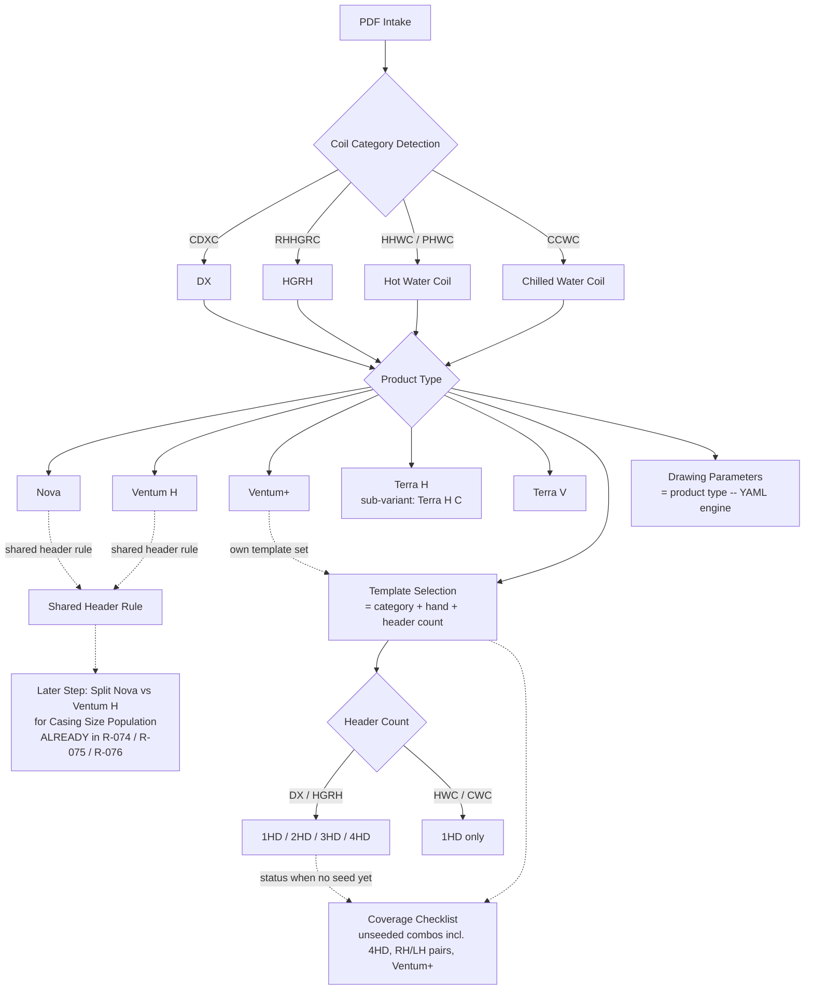

# CLAUDE.md

This file provides guidance to Claude Code (claude.ai/code) when working with code in this repository.

## What CoilForge is

An internal coil-engineering tool that turns captured coil inputs (a "Direct Coil"
form, a submittal document, or a scanned EZ Coil / CoilMaster PDF) into a populated
**review-aid** drawing, a paste-ready field set, and a validation/compatibility report.
It is not selection software and not a manufacturing-drawing release system.

Read `AGENTS.md` before changing anything — it defines the project's hard boundaries
and the required report-back format. The most load-bearing rules:

- Never modify raw JSON or raw PDF files; never invent engineering values.
- Inferred mappings are **review-required** until John (the engineer/owner) or
  engineering confirms them — never treat them as confirmed.
- Generated drawings are review aids until formally approved; do not claim approval
  or enable production export.
- Do not build the full selection-calculation engine unless explicitly approved.

## Commands

Tests run from the repo root; each test file inserts `src/` onto `sys.path`, so there
is no install step or `pyproject.toml`.

- Full suite: `python -m pytest -q`
- Single file: `python -m pytest tests/test_header_prepopulate_engine.py -q`
- Single test: `python -m pytest tests/test_header_prepopulate_engine.py::test_name -x`
- Run the local web app (Windows, port 8011): double-click / run `run_server.bat`
  (NOTE: `run_server.bat` runs uvicorn WITHOUT `--reload` — restart it after any `src/`
  edit, and re-analyze the PDF in the browser since `pdfCoilPages` is cached client-side,
  or your change won't show. The manual `--reload` entrypoint below auto-reloads.)
- Run the web app manually: `python -m uvicorn coilforge.web_app:app --app-dir src --reload`
  (the README's `coilforge.phase2a.app:app` entrypoint also works; `web_app` extends it)
- Re-seed ONE drawing template from a corrected reference PDF:
  `python scripts/seed_templates_from_pdf.py build-one <template_id>` (delete that bucket's 4
  artifacts first for a clean regen — `build_bucket` won't rewrite existing metadata/evidence
  and only merges `slot_map`).

Runtime deps that may need installing: `python -m pip install fastapi uvicorn pyyaml pydantic`.
PDF intake uses PyPDF2. Tests `pytest.importorskip("fastapi")` so they degrade gracefully.

## Architecture — the big picture

Two input tracks converge on a shared canonical model, then fan out to drawings.

**Track A — Direct Coil form → drawing** (`services/direct_coil_drawing_pipeline.py`):
1. `build_header_request(...)` — coil inputs → `HeaderPrepopulateRequest`.
2. `prepopulate(request)` — the YAML rule engine (see below).
3. `build_drawing_slots(...)` — resolve **every** dimension slot from a mechanical
   value (engine HIGH value, recovered formula, coil input, or exact EZ JSON override).
4. `select_drawing_template` + `populate_template_slots` → SVG.

**Track B — submittal/PDF → drawing** (`workflows/submittal_to_drawing.py`):
submittal text or PDF bytes → `SubmittalCoilCandidate` → `CanonicalCoilRecord`
→ `DirectCoilInputDraft` → resolved drawing parameters → SVG preview. The PDF path
additionally calls `submittal/pdf_to_template_drawing.py` to read as-built values
straight off the scanned drawing into a template-first drawing.

**The header rule engine** (`services/header_prepopulate_engine.py` +
`rules/coil_header_rules.yaml`) is the heart of the system. It is a pure, deterministic
function with one I/O (loading the cached YAML rule table). Rules are identified by IDs
(`R-070`, etc.); most go through a generic constant/conflict emitter, but a set of
`_SPECIAL_IDS` (casing depth, return spacing, CWC/HWC io/hd/sl, notes assembly, etc.)
are handled by dedicated phase helpers. Formulas use explicit safe helpers — **never
`eval`**. When changing engineering behavior, edit the YAML rule and/or its helper, not
ad-hoc code elsewhere. Rules can scope to specific unit sizes via `applies_to.size_pattern`
(e.g. `[H05, H10]`), now matched in `_applies` (null = all sizes). Combine with last-writer-wins
(rules applied in YAML order; the generic emitter's `place()` overwrites per field) for
size/variant overrides — e.g. R-025b/R-044d (size) and R-012v/R-021v/R-046 (Terra-V).

**Dual-path gotcha:** some per-header drawing dims are computed in `build_drawing_slots`
(the slot layer), NOT the engine — DX distributor `S`, return spacing `R`, and Terra V's
CD/CH-relative formulas (`S = CD − Rn`, CWC return `O = CH − 2.75`). Changing such a value
means editing BOTH the engine rule/helper AND the slot layer, and threading `terra_variant`
into `build_drawing_slots` where a variant-specific drawing formula is needed (the generic-R
safety net is guarded `and not is_terra_v` so Terra V never borrows Terra H's spacing).

**The confidence gate is the central invariant.** Every rule carries a confidence that
routes its output (`bucket_for_confidence`):
- `HIGH` → `values` — auto-prepopulated / drawn.
- `MEDIUM` → `suggestions` — always `review_required`, surfaced but never silently drawn.
- `LOW` / `CONFLICT` → `blocked` — `value=None` with a `blocked_reason`.
This gate is enforced again at the data-contract layer and must be preserved end to end.

**Data contracts** (`contracts/`) — every imported/prepopulated value is wrapped:
- `FieldValue` — traceable value with `source_evidence`, `confidence`, `status`,
  `review_required`. Its validator **requires `source_evidence` for any non-null,
  non-override value** — you cannot smuggle in a bare value. Keep raw source evidence
  separate from normalized interpretation.
- `CanonicalCoilRecord` — the internal source of truth; auto-collects
  `review_required_fields` / `blocked_fields` from its `FieldValue` members.
- `SubmittalCoilCandidate` (`submittal/candidate.py`) — the pre-canonical extract.

**Templates** (`templates/drawing/coilmaster/<category>/<id>/template.svg`) are real
CoilMaster-format SVGs with engineering values redacted to named slots (`slot.CD`,
`slot.HD2`, `slot.I1`, …). `template_population/` selects a template
(`catalog.ACTIVE_TEMPLATES`, keyed by supplier/category/hand/header type), populates
slots (`slot_population.py`), and mirrors LH↔RH (`mirror.py`). Each template is either
seeded from a provided PDF or mirrored from a seeded pair — both are review-aid only.
Schemas for the catalog / slot map live in `schemas/*.schema.json`.

**Web app** — `coilforge/web_app.py` imports the Phase 2A FastAPI `app` and registers
the `/api/*` routes (workflows, compatibility review, decision capture, review packets).
The browser UI is vanilla JS in `web/` (`index.html` / `app.js` / `style.css`). API
responses deliberately assert safety flags (`raw_private_data_returned: False`,
`export_allowed: False`, `production_drawing_approval_claimed: False`).
Empty drawing-parameter fields render RED with their `blocked_reason` as inline English
evidence + a hover tooltip (`web/app.js::renderParameterRow`); the frontend colors by
emptiness, not backend `status`, so a missing value never reads as a silent blank — don't
revert empties to plain blanks.

## CoilForge MVP taxonomy (confirmed 2026-06-21)

The EZ-coil drawing-template tool follows a four-level decision tree
(category → product type → header count → drawing), plus a deferred Nova/Ventum-H
casing split. The rules below are the **confirmed MVP taxonomy**. Where a rule states a
**target** that the code does not yet implement, that is flagged explicitly in
*Current code state vs confirmed target* at the end of this section — do not assume the
target already exists in code.

### Coil category detection

PDF intake derives the coil **category** from the unit/coil tag prefix
(`submittal/pdf_intake.py::_COIL_TYPE_BY_PREFIX` / `_COIL_FORMAT_BY_PREFIX`):

- `CDXC` → **DX**
- `RHHGRC` (aliases `HGRC`, `RHHGRH`, `HGRH`) → **HGRH** — Oxygen8 submittals use both
  the `…RC` and `…RH` reheat-tag spellings (e.g. 2766 Olympic uses `RHHGRH-1`); all map
  to the same HGRH category
- `HHWC` / `PHWC` → **HWC** (Hot Water Coil)
- `CCWC` → **CWC** (Chilled Water Coil)

### Product family rules

First-class product types: **NOVA, VENTUM_H, VENTUM_PLUS, TERRA_H, TERRA_V**.

- **Nova + Ventum H share one header-rule set** and diverge only at casing-size
  population: `R-074` casing-dims lookup has distinct `NOVA|…` / `VENTUM_H|…` keys,
  `R-075` is a Nova-only size class, and `R-076` carries separate size sets. This is the
  "Later Step: split Nova vs Ventum H for casing size population" — **already implemented**.
- **Terra H and Terra V are distinct product types** (not one Terra family).
  **Terra H C** is a sub-variant *under* Terra H.
- Drawing **values** are always selected by product type (the YAML engine).
- Template **selection** is product-family-agnostic **except Ventum+**, which forks its
  own template set. *Target:* a full parallel Ventum+ bucket matrix selected via a catalog
  `product_family` discriminator, replacing the current downstream
  `_UNREGISTERED_PRODUCT_LINES` hard-block in `workflows/submittal_to_drawing.py`.

### Header count rules

- **DX / HGRH:** header counts **1HD–4HD** are all first-class. 4HD is buildable **only
  after a real 4HD reference PDF is seeded** — never via surrogate or mirror generation,
  never invented.
- **HWC / CWC:** **1HD only**.
- Header count drives **template selection** (`template_population/catalog.py`), **not**
  the rule engine. The engine handles multi-header geometry via `circuits` / `feeds`
  formula inputs (`R-022`, `R-034`, `R-048`, `R-072`/`R-073`).

### Manual review rules

- The **confidence gate** is the central invariant: `HIGH` → `values` (auto-drawn);
  `MEDIUM` → `suggestions` (always `review_required`, never silently drawn);
  `LOW` / `CONFLICT` → `blocked` (`value=None` + `blocked_reason`).
- Inferred mappings stay **review-required** until John / engineering confirm them.
- Generated drawings are **review aids** (`export_allowed: False`) until formally approved.
- **No surrogate / mirror template generation** — each hand/header must be seeded from its
  own real reference PDF.
- **Terra V** is largely SOP-only (single-source) across categories, so it routes to
  `LOW` / blocked (`R-023` DX spacing, `R-046` HGRH, `R-067` CWC/HWC vent-drain).

### MVP checklist

Coverage = which `(category, hand, header, product family)` template buckets are **seeded**
vs **unseeded**. Unseeded buckets (`needs_pair` / `placeholder_blocked`,
`generation_allowed=False`) are tracked work items. Currently **10 of 22** buckets are
active review aids; the rest await seeding. Coverage is surfaced today via the
hand-authored `docs/coverage_dashboard.html` (a point-in-time snapshot; a generator is a
follow-up item).

### Corrected taxonomy diagram

### Current code state vs confirmed target

The taxonomy above is the **target**. Code alignment is a separate, John-requested plan.
Until then, the code differs as follows — do not assume the target is implemented:

| Area | Current code | Confirmed target |
| --- | --- | --- |
| Product family enum | `ProductFamily {NOVA, TERRA, VENTUM_H, VENTUM_PLUS}` + `TerraVariant {TERRA_H, TERRA_H_C, TERRA_V}` (`schemas/header_prepopulate.py`) | Split `TERRA` → `TERRA_H` + `TERRA_V`; demote `TERRA_H_C` to a sub-variant of Terra H |
| 4HD buckets | `placeholder_blocked` (permanent dead-end) in `template_population/catalog.py` | `needs_pair` — buildable once a real 4HD reference PDF is seeded |
| Ventum+ | Downstream hard-block via `_UNREGISTERED_PRODUCT_LINES` in `workflows/submittal_to_drawing.py` | Catalog `product_family` discriminator + full parallel Ventum+ bucket matrix |
| Coverage checklist | Hand-authored `docs/coverage_dashboard.html` snapshot | Generated from `template_population/catalog.list_template_entries()` |

## Conventions

- Python 3.11+, `from __future__ import annotations`, full type hints, Pydantic v2
  with `ConfigDict(extra="forbid")` on data models.
- Engineering logic is rule/data-driven and must stay explainable: prefer adding a YAML
  rule with `evidence_refs` over hardcoding a value in Python.
- Tests are organized by phase (`test_phase2a_*` … `test_phase2e_*`) plus feature-named
  files. There are 400+ tests; run the full suite before claiming a task is done.
- `.gitignore` blocks raw customer data by pattern (`*.pdf`, `*.xlsx`, `Case/`,
  `*_raw.json`, rendered PNG/JPG). Only sanitized fixtures under `examples/sanitized/`
  belong in the repo.

## Drawing engine (parametric — in progress)

The current submittal path fills a fixed SVG template via text substitution (static
geometry — a coil with FL=120" draws the identical box as FL=20"). We are building a
**parametric drawing engine** that redraws the coil to scale from resolved dimensions,
targeting three first-class outputs: **SVG** (web review aid), **DXF** (shop / CAD
handoff), and **PDF** (customer submittal).

### Architecture — non-negotiable

1. **Three layers, never collapsed.** geometry model -> layout/datum engine ->
   renderer backend. Rendering code must not compute geometry; layout code must
   not emit SVG/DXF/PDF.
2. **Model is in real-world units (inches).** The geometry model and datum engine
   carry true dimensions only — never pixels. Presentation scale lives in the
   backend (see Output backends). One model, three backends.
3. **Backend-swappable renderer.** SVG, DXF, and PDF backends all consume the same
   geometry model. Adding or changing a backend must not touch the model or
   layout layers. The model emits no renderer-specific types.
4. **Input contract = gated `slot_values` only.** The engine consumes dimensions
   already resolved and confidence-gated upstream (`slot.FH`, `slot.FL`,
   `slot.CH`, `slot.CL`, `slot.CD`, `slot.HF`, header offsets...). Validation
   stays upstream. The engine never invents a value: `None` / "REVIEW REQUIRED"
   -> feature omitted and annotated, never guessed.
5. **Datum/offset only — no absolute coordinates.** Every feature is placed
   relative to computed datums (the "grid"). Doubling any dimension must move all
   dependent features coherently. Hardcoded path coordinates are a defect.
6. **No constraint solver / CAD kernel.** Deterministic recompute only. Do not
   add an iterative or symbolic solver unless explicitly requested.
7. **Aspect ratio preserved.** Scaling is uniform — never scale x and y
   independently. That is the bug in `phase2a/renderer.py` (x18 / x16) we are not
   repeating.

### Output backends

The model holds inches; each backend decides how to present them:

- **SVG (review aid):** uniform `px_per_inch` (clamped via the `max(min(...))`
  idiom), fit-to-canvas, centered. Watermark, `export_allowed: False`.
- **DXF (shop / CAD):** emit **1:1 model-space geometry in inches** — no
  fit-to-canvas scaling. Use layers (geometry / dimensions / annotation / title
  block) and native dimension entities. Must import cleanly into DraftSight /
  SolidWorks.
- **PDF (submittal):** compose the drawing at a **declared drawing scale** on a
  sheet (paper size + title block standard). Dimension precision per submittal
  spec. `export_allowed` flips to `True` only after the submittal validation gate
  passes.

### Annotation rule

Geometry scales; annotations do not. Dimension text, arrowheads, and
witness-line labels are drawn at **fixed size** (in the SVG/PDF backends),
anchored to datums. Scaling text or arrowheads is a defect.

### Phase Gate workflow

- Multi-file changes: **plan first, hold for approval before writing code.**
- A phase closes only when: all tests green **and** an eyeball-verifiable result
  exists.
- Do not advance past a red gate. Do not silently expand scope beyond the
  approved phase.

### Where things live

- Engine (new): `src/coilforge/drawing/schematic_renderer.py`
- Layout/datum module: extracted in Phase 2 — keep it separable from day one.
- Renderer backends: `src/coilforge/drawing/backends/` (`svg.py`, `dxf.py`,
  `pdf.py`).
- Tests: `tests/test_schematic_renderer.py`
- Existing template path — **DO NOT TOUCH**: `slot_population.py::populate_template_slots`,
  the 17 `template.svg` files, `pdf_to_template_drawing.py`.
- The rendered review-aid drawing's dimension-callout labels are remapped to Direct-Coil terms
  at render time by `drawing/label_authority.py::direct_coil_label` (applied in
  `workflows/submittal_to_drawing.py::_clean_callout`) — **not** taken from the EZ-coil-seeded
  `template.svg` text.
- Reuse from `phase2a/renderer.py`: the clamp idiom, `REVIEW_WATERMARK`,
  `_esc` / `_text_line` / `_fmt`. Do **not** reuse its x18 / x16 scaling.
  Note: `_conn_float` lives in the frozen `submittal/pdf_to_template_drawing.py`,
  **not** in `renderer.py` — do not import it from that DO-NOT-TOUCH module; the
  engine uses its own `_slot_inches` slot-coercion helper instead.

### Drawing-engine conventions

- Renderers are **pure functions**: input -> result object, no side effects, no
  file writes.
- **Additive only** — no schema changes that would break the upstream confidence
  gate.
- Carry safety flags through: `export_allowed: False` + watermark until the PDF
  submittal path explicitly promotes output to production.

### Test requirements (every change)

- Proportionality: doubling a dimension slot doubles its size within clamps;
  `FL:FH` ratio preserved.
- **Cross-backend dimension parity:** the same coil yields identical real
  dimensions across SVG, DXF, and PDF (only presentation scale differs).
- **DXF 1:1:** geometry emitted in true inches; round-trips at real size.
- **PDF scale:** renders at the declared drawing scale on the chosen sheet.
- One case per category: DX 1/2/3, HGBP, HGRH, CWC, HWC.
- LH <-> RH mirror.
- Missing-slot omission (`None` / "REVIEW REQUIRED" -> omitted + annotated).
- Safety flags asserted (`export_allowed`, watermark present where required).

### Roadmap

1. Engine v0 — geometry model (real units) + DX front view, **SVG** backend +
   tests.
2. Extract layout/datum module; add header/side view (LH/RH mirror).
3. Feature library — all 17 via a `(category, hand, header, special)` spec table.
4. **DXF** backend via `ezdxf` (1:1 inches, layers, dimension entities); verify
   DraftSight / SolidWorks import.
5. **PDF** backend (submittal: title block, declared scale, dimension precision);
   wire the export validation gate that flips `export_allowed`.
6. Integration — wire all three backends into the pipeline + web UI; retire
   template dependency for covered categories.
