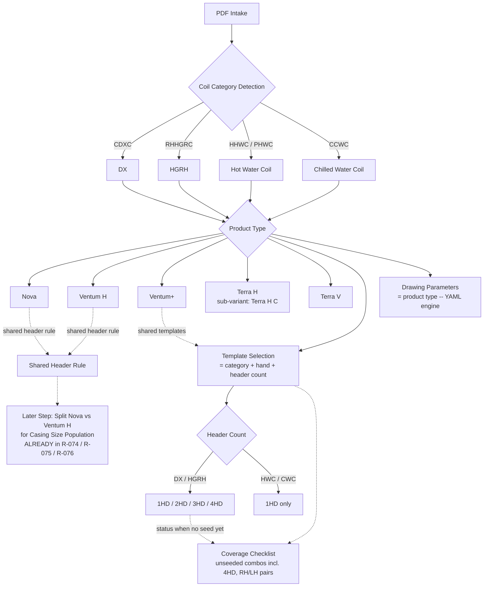

# CLAUDE.md

This file provides guidance to Claude Code (claude.ai/code) when working with code in this repository.

## What CoilForge is

An internal coil-engineering tool that turns captured coil inputs (a "Direct Coil"
form, a submittal document, or a scanned EZ Coil / CoilMaster PDF) into a populated
**review-aid** drawing, a paste-ready field set, and a validation/compatibility report.
It is not selection software and not a manufacturing-drawing release system.

Read `AGENTS.md` before changing anything — it defines the project's hard boundaries
and the required report-back format. The most load-bearing rules:

- Never modify raw JSON or raw PDF files; never invent engineering values.
- Inferred mappings are **review-required** until John (the engineer/owner) or
  engineering confirms them — never treat them as confirmed.
- Generated drawings are review aids until formally approved; do not claim approval
  or enable production export.
- Do not build the full selection-calculation engine unless explicitly approved.

## Commands

Tests run from the repo root; each test file inserts `src/` onto `sys.path`, so there
is no install step or `pyproject.toml`.

- Full suite: `python -m pytest -q`
- Single file: `python -m pytest tests/test_header_prepopulate_engine.py -q`
- Single test: `python -m pytest tests/test_header_prepopulate_engine.py::test_name -x`
- Run the local web app (Windows, port 8011 by default): double-click / run `run_server.bat`,
  or `run_server.bat 8012` to run a second project side by side. A busy port is auto-avoided
  by scanning upward and the port actually used is printed on startup, so **read the window**
  rather than assuming 8011. Excel COM is serialized across every running server
  (`common/excel_lock.py`), so two checklist fills queue instead of leaving zombie EXCEL.EXE
  processes; a fill still blocked after the bounded wait returns HTTP **409** (distinct from
  the 501 that means Excel/pywin32 is absent), and `/api/deliverable/finalize` treats 409 as a
  hard error rather than filing the order folder without its .xlsx. `COILFORGE_EXCEL_LOCK=0`
  disables the guard.
  (NOTE: `run_server.bat` runs uvicorn WITHOUT `--reload` — restart it after any `src/`
  edit, and re-analyze the PDF in the browser since `pdfCoilPages` is cached client-side,
  or your change won't show. The manual `--reload` entrypoint below auto-reloads.)
- Run the web app manually: `python -m uvicorn coilforge.web_app:app --app-dir src --reload`
  (the README's `coilforge.phase2a.app:app` entrypoint also works; `web_app` extends it)
- Re-seed ONE drawing template from a corrected reference PDF:
  `python scripts/seed_templates_from_pdf.py build-one <template_id>` (delete that bucket's 4
  artifacts first for a clean regen — `build_bucket` won't rewrite existing metadata/evidence
  and only merges `slot_map`).

Runtime deps that may need installing: `python -m pip install fastapi uvicorn pyyaml pydantic`.
PDF intake uses PyPDF2. Tests `pytest.importorskip("fastapi")` so they degrade gracefully.
The Coil Checklist auto-fill (below) uses Excel COM via `pywin32` (already present on
the Windows box) and reads `.xlsx` back with `openpyxl`; its writer test is guarded by
`pytest.importorskip` so the suite still runs where Excel/pywin32 is absent.

## Architecture — the big picture

Two input tracks converge on a shared canonical model, then fan out to drawings.

**Track A — Direct Coil form → drawing** (`services/direct_coil_drawing_pipeline.py`):
1. `build_header_request(...)` — coil inputs → `HeaderPrepopulateRequest`.
2. `prepopulate(request)` — the YAML rule engine (see below).
3. `build_drawing_slots(...)` — resolve **every** dimension slot from a mechanical
   value (engine HIGH value, recovered formula, coil input, or exact EZ JSON override).
4. `select_drawing_template` + `populate_template_slots` → SVG.

**Track B — submittal/PDF → drawing** (`workflows/submittal_to_drawing.py`):
submittal text or PDF bytes → `SubmittalCoilCandidate` → `CanonicalCoilRecord`
→ `DirectCoilInputDraft` → resolved drawing parameters → SVG preview. The PDF path
additionally calls `submittal/pdf_to_template_drawing.py` to read as-built values
straight off the scanned drawing into a template-first drawing.

**Multi-coil quote package** (`package/assembler.py`) inserts each coil's CoilForge
drawing after its source drawing page, located by an alias-tolerant tag match
(`pdf_intake.coil_tag_aliases` — only true spelling variants like RHHGRC↔RHHGRH, NOT
HHWC/PHWC which are distinct coils). A coil that can't be matched gets a
`not_inserted_reason` and is surfaced loudly, never silently dropped.
Copper-strap notes/prices apply ONLY to DX/HGRH (`copper_strap_pricing.COPPER_STRAP_COIL_TYPES`);
CWC/HWC are `not_applicable` — no strap note is ever stamped.
A cover schedule that spills onto a 2nd+ page has its continuation rows parsed **table-first**
(`pdf_intake._with_continuation_cover_rows` → `_detect_cover_page_from_tables`, header-less
positional fallback), NOT the text-line parser — the text parser never captures the `model`
column, so a continuation coil would otherwise lose its product/model code (e.g. Terra V
`TV_B_024` → blank product line → fit can't evaluate).

**Stacked detail sections (2026-07-28):** the Oxygen8 detail grid puts several sections in ONE
column, one above the other — col7 holds `Coil Operating Setpoint` and then `Max Coil
Performance`. `_detail_table_section_columns` returns per-column `(row_index, context)`
**switches** and `_detail_table_field_pairs` picks the context in force at that row
(`_context_at_row`); the column LAYOUT still comes from the first section row because those
columns are also the value-range boundaries. One context per column silently dropped the whole
lower block — `DB (F)` under the setpoint is the setpoint, under Max Coil Performance it is the
**leaving** dry bulb, so a column-wide context resolves the second one to nothing. DX never
showed the bug (its max-perf rows sit on otherwise-empty lines, so the text-line parser rescued
them); a water coil's denser `Coil` column collides with them and nothing did. Fixing it also
corrected DX `total_capacity_mbh` (it had been capturing `Nominal Cooling Capacity` — 365.85 vs
the real 123.88; the nominal value is still carried separately).

**The header rule engine** (`services/header_prepopulate_engine.py` +
`rules/coil_header_rules.yaml`) is the heart of the system. It is a pure, deterministic
function with one I/O (loading the cached YAML rule table). Rules are identified by IDs
(`R-070`, etc.); most go through a generic constant/conflict emitter, but a set of
`_SPECIAL_IDS` (casing depth, return spacing, CWC/HWC io/hd/sl, notes assembly, etc.)
are handled by dedicated phase helpers. Formulas use explicit safe helpers — **never
`eval`**. When changing engineering behavior, edit the YAML rule and/or its helper, not
ad-hoc code elsewhere. Rules can scope to specific unit sizes via `applies_to.size_pattern`
(e.g. `[H05, H10]`), now matched in `_applies` (null = all sizes). Combine with last-writer-wins
(rules applied in YAML order; the generic emitter's `place()` overwrites per field) for
size/variant overrides — e.g. R-025b/R-044d (size) and R-012v/R-021v/R-046 (Terra-V).
Terra V carries its OWN R-076 size set (`TERRA_V` key = Terra H's 9 + 060/072/084/100);
since Terra H and V both resolve to `product_family TERRA`, the engine size gate branches
on `terra_variant` to pick it — and **casing R-074 likewise branches on `terra_variant`**:
Terra V has its own `TERRA_V|INTEGRATED|0xx` table (vertical units are far taller than Terra
H) so it never borrows Terra H's `TERRA|...` casing; all 13 Terra V sizes now resolve.

**Dual-path gotcha:** some per-header drawing dims are computed in `build_drawing_slots`
(the slot layer), NOT the engine — DX distributor `S`, return spacing `R`, and Terra V's
CD-relative formula `S = CD − Rn`. Changing such a value
means editing BOTH the engine rule/helper AND the slot layer, and threading `terra_variant`
into `build_drawing_slots` where a variant-specific drawing formula is needed (the generic-R
safety net is guarded `and not is_terra_v` so Terra V never borrows Terra H's spacing).

**CWC/HWC return spacing `R = S` (John 2026-07-28)** — a water coil's supply and return headers
are symmetric: **all seven** seeded water references read `R{even} == S{odd}` (and `O == I`
with them). There is no `return_spacing` rule for water (R-022/R-023 are DX, R-052 is HGRH) and
the generic net both excludes Terra V and keys off the DX-named `suction_conn_size`, so water R
was blank on every product line. The slot layer's water branch **owns** R — it deliberately
does not fall through to the generic net, because an R whose S is blank has no basis. Written
only when `slot.S` exists (S needs `cd`), so an un-gated coil leaves R blank instead of raising.
Kept in the slot layer, not YAML, for the same reason as the Terra V `S = CD − Rn` special:
the water `S` it mirrors is itself a slot-layer value the engine never emits — a YAML rule
placed before this branch would be permanently shadowed, i.e. a rule that documents a value it
never produces. **Open:** the water `S` formula `k*CD/(circuits+1)` reproduces NO seed `S1`
(seed CD 4.63 → 2.315 vs actual 1.63) and `I1 = 2.31` is constant across CD 3.38–7.25, so `I` is
not CD-derived either — the HWC seed matching `CD/2` is a coincidence. R inherits that
uncertainty; both stay review-required until a real water S source is confirmed.

**The confidence gate is the central invariant.** Every rule carries a confidence that
routes its output (`bucket_for_confidence`):
- `HIGH` → `values` — auto-prepopulated / drawn.
- `MEDIUM` → `suggestions` — always `review_required`, surfaced but never silently drawn.
- `LOW` / `CONFLICT` → `blocked` — `value=None` with a `blocked_reason`.
This gate is enforced again at the data-contract layer and must be preserved end to end.

**Promoting MEDIUM→HIGH:** the bucket is chosen by `confidence` ALONE — the YAML `review_required:`
field is never read by the engine (it is derived from confidence). So a promotion is a one-line YAML
`confidence` edit **only for rules the generic emitter handles**; rules in `_SPECIAL_IDS` (e.g. R-048,
R-074) hardcode `Confidence.MEDIUM` in their Python helper, so a YAML flip is inert — edit the helper.
Some IDs never promote: R-073's `casing_depth` is already emitted HIGH by R-070, and R-077 is data-only
(consumed by `mechanical_fit`, never bucketed).

**Data contracts** (`contracts/`) — every imported/prepopulated value is wrapped:
- `FieldValue` — traceable value with `source_evidence`, `confidence`, `status`,
  `review_required`. Its validator **requires `source_evidence` for any non-null,
  non-override value** — you cannot smuggle in a bare value. Keep raw source evidence
  separate from normalized interpretation.
- `CanonicalCoilRecord` — the internal source of truth; auto-collects
  `review_required_fields` / `blocked_fields` from its `FieldValue` members.
- `SubmittalCoilCandidate` (`submittal/candidate.py`) — the pre-canonical extract.

**Templates** (`templates/drawing/coilmaster/<category>/<id>/template.svg`) are real
CoilMaster-format SVGs with engineering values redacted to named slots (`slot.CD`,
`slot.HD2`, `slot.I1`, …). `template_population/` selects a template
(`catalog.ACTIVE_TEMPLATES`, keyed by supplier/category/hand/header type), populates
slots (`slot_population.py`), and mirrors LH↔RH (`mirror.py`). Each template is either
seeded from a provided PDF or mirrored from a seeded pair — both are review-aid only.
Schemas for the catalog / slot map live in `schemas/*.schema.json`.

**Redaction gotcha:** `populate_template_slots` substitutes `{{slot.X}}` ONLY for slot_ids
listed in that template's `slot_map.json` `slots[]` — not every `{{slot.*}}` in the SVG. So
redacting a hardcoded as-built dim to a NEW slot means adding it to BOTH `template.svg` AND
`slot_map.json`, or the placeholder renders literally (`{{slot.SL1}}`).

**Mechanical fit / stability** (`compatibility/mechanical_fit.py`) — a review-aid check
(NOT in the drawing path) mirroring the Coil Checklist WIDTH/HEIGHT/INSTALL fit.
`evaluate_coil_fit` (FL/OAL vs casing width, FH/CH vs casing height) and
`evaluate_drain_pan_fit` (paired DX+HGRH / CWC+HWC: `this_CD + partner_CD < drain-pan width`)
read two DATA-ONLY rules — `R-078` (fit clearances) and `R-077` (drain-pan / install widths) —
listed in the engine's `_FIT_DATA_IDS` so the generic emitter SKIPS them (consumed here, never
emitted as engine fields). `build_mechanical_fit_report` pairs coils via
`pdf_intake.drain_pan_partner_tag`, is exposed at `POST /api/mechanical-fit`, and renders as the
"Mechanical Fit / Stability" section. Casing dims are MEDIUM, so every verdict is `review_required`
— a PASS is never an approval; missing inputs -> `CANNOT_EVALUATE`.

**Coil Checklist auto-fill** (`checklist/`) — fills a COPY of Oxygen8's "Coil Checklist
Template.xlsx" from a submittal so the engineer stops hand-typing column C, and cross-checks
it against CoilForge. Four layers kept separate: `template_map.py` (pure structural reference
— sheet names, fillable labels, dropdown vocab, checkbox defaults; transcribed by Phase-0 COM
introspection, no Excel dep), `mapping.py`/`model.py` (pure: coil dicts -> `ChecklistFill`),
`excel_writer.py` (I/O — Excel COM in an ISOLATED `DispatchEx` instance; opens the template
read-only + `SaveCopyAs` to Downloads so the original is NEVER touched; locates fields by
scanning column B; sets native boolean checkboxes by writing `True`/`False`), and `compare.py`
(the review table). **Load-bearing fact:** the checklist's lower dimensions (CD/S/O/R/HD/SL/
OAL/CH/ASC/FIT…) are Excel FORMULAS that compute from the inputs — the writer fills ONLY the
input cells and lets the sheet recompute, then reads the formula results back and compares them
to CoilForge's engine slots (independent implementations -> real accuracy check, not circular).
Reuses the engine like `mechanical_fit` (`build_drawing_slots` + an application-aware
`prepopulate` for casing). Exposed at `POST /api/checklist/fill` (POST the PDF bytes); renders
as the "Coil Checklist Auto-Fill" section. Review aid only; missing values left blank + flagged,
never guessed. The DO-NOT-TOUCH drawing/template path is untouched.
Auto-fills on analyze (frontend `maybeAutoFillChecklist` after `hydratePdfWorkflow`; default-on
`#checklist-auto-toggle`, the manual "Fill" button was removed) and is memoized server-side by
`sha1(pdf_bytes)` (`_run_or_reuse_checklist` / `_CHECKLIST_CACHE`, key = sha1 + product + size +
cover_page_hint + **overrides fingerprint**) so `deliverable_finalize` reuses the same Downloads
.xlsx instead of re-running Excel COM (no double-fill).

**Manual overrides reach the checklist (John 2026-07-29)** — the drawing regenerated from a
manual fill while the checklist kept re-deriving from the submittal, so the sheet (and the .xlsx
filed with the order) silently disagreed with the drawing. `checklist/overrides.py` (pure) carries
the browser fills in: **Tier A** engine inputs (`rows`/`application`/`coil_hand`/`return_conn_size`
…) are ordinary column-C INPUT cells, so writing them lets the sheet recompute and *strengthens*
the cross-check; **Tier B** drawing params resolve their slot through the DRAWING path's own
`PARAM_TO_SLOT`/`_header_slot` (`overrides.param_slot`) so the two can't disagree about what `S2`
means. This partially amends the load-bearing fact above: an overridden dim's formula IS
overwritten with the drawn value — but only in writer step 5, **after** step 4 read the formula's
own result back, so `compare.py` still reports both as verdict `overridden` (never `match`, never
counted as a mismatch) and an Excel cell comment records the replaced value + reason. A second
`CalculateFull` then follows so dependents (OAL/CH, the FIT checks) track the override. **Order is
load-bearing** — overwrite before read-back and the independent check is gone. A fill with no
overrides skips the whole block (byte-identical to the pre-2026-07-29 path). Overrides ride the
JSON body form of `POST /api/checklist/fill` (`{submittal_pdf_base64, coil_overrides}`; the raw
`application/pdf` body is unchanged) and `checklist_overrides` on `/api/deliverable/finalize` —
without that second thread the finalize would key differently and file the pre-override sheet.
Frontend: `collectChecklistOverrides` (keyed by `page.tag`, like `reapplyManualFills`) +
debounced `scheduleChecklistRefill` after an interactive derive; the headless re-analyze fan-out
fires it ONCE after `Promise.allSettled` instead of per coil. `_try_checklist_review` (project
gate) deliberately passes none — it reads the machine proposal.

**CCSI value push + green/red compare** (`ccsi/compare.py`, `web/ccsi/`) — pushes the resolved
drawing params into the external CCSI Direct Coil form (Claude-in-Chrome `/ccsi-fill`; never
auto-saves, read-only CCSI-computed fields skipped) and reads them back to compare vs CoilForge,
colouring each field green(match)/red(mismatch) at `POST /api/ccsi-compare`. Reuses
`checklist/compare.py::_match` (tol 0.01) as the single comparator — a divergence (e.g. CDXC-1
R 3.317 vs 1.3125) flags red before John saves. Review aid only (`export_allowed: False`);
multi-header keys (I2/S2…) push only when present in `parameters` AND in the field map.

**Manual fill (human-in-the-loop)** (`services/drawing_param_resolver.py::build_manual_fill_plan`,
`workflows/submittal_to_drawing.py::_rerun_slots_with_manual_inputs`, `web/app.js::renderManualFillPanel`)
— when a coil blocks, the engineer fills the missing data in the browser and the drawing regenerates
instead of halting and bouncing back to Claude. Tier A = engine inputs (rule engine recomputes,
un-gating CD→CH→S→SL); Tier B = drawing-param direct override — since 2026-07-16 (John) the override
is **reflected into the drawing**: the non-frozen `_reflect_param_overrides_into_slots` merges it into
`slot_values` + re-populates the SVG (mirroring `_apply_hgrh_pairing_cd`; the resolver's panel builder
`parameter_set_from_template_drawing` stays panel-only). It stays `mode='manual'`/review_required and
`export_allowed` False (never HIGH/approved). The pre-override machine proposal is event-sourced into
`result['manual_override_events']` at derive time so the `correction` ledger stores the true "before"
(a later override-free recompute would read the overridden slot). Fires ONLY when `param_overrides` are
present → no-override derive stays byte-identical. GOTCHA: the three inputs the derive path drops
(`application`/`header_count`/`qty_conn_per_header`) are un-gated by re-running `build_drawing_slots`
in the NON-frozen caller `derive_coil_template_drawing` and merging `slot.X` keys into
`result["slot_values"]` — NEVER edit the frozen `pdf_to_template_drawing.py::derive_slot_values` to
thread them. The re-run fires ONLY when one of the three is supplied, so a coil with no manual fill
is byte-identical (H4 regression guard). `POST /api/coil-drawing/derive` is the SINGLE fill endpoint;
a multi-coil re-analyze re-applies fills via the frontend (headless `/derive` per coil, keyed by tag)
— the PDF workflow is PDF-bytes-memoized, so a server header would hit the pre-fill cache. Every value
stays `review_required`/`manual_override` and `export_allowed` stays False; a `ManualOverride` audit
entry is logged per fill; env `COILFORGE_MANUAL_FILL=0` disables the feature (rollback without reverting).

**Engineering Wiki** (`docs/wiki/`, schema `docs/wiki/WIKI.md`) — an LLM-maintained,
interlinked markdown knowledge base (Karpathy "LLM Wiki" pattern) that is the human-readable
synthesis layer ABOVE the YAML rule table: one page per coil category / product family / concept,
every claim badged (`[CONFIRMED]`/`[REVIEW-REQUIRED]`/`[BLOCKED]`, mirroring the confidence gate)
and cited with the engine's `evidence_ref` grammar. Raw sources stay external/gitignored —
`docs/wiki/sources.md` is a citation registry, not the files (review aid only; never invents
values). Maintained via `/wiki-ingest`, `/wiki-query`, `/wiki-lint`; the lint pass cross-checks
wiki claims against `coil_header_rules.yaml`/enums and reconciles `open-questions.md` against
`docs/MVP_FINALIZATION_CHECKLIST.md`. Distinct from the auto-memory (decision log) and
`docs/rules/coil_header_rule_extraction.md` (per-cell dictionary) — it links to both, duplicates neither.

**Web app** — `coilforge/web_app.py` imports the Phase 2A FastAPI `app` and registers
the `/api/*` routes (workflows, compatibility review, decision capture, review packets).
The browser UI is vanilla JS in `web/` (`index.html` / `app.js` / `style.css`). API
responses deliberately assert safety flags (`raw_private_data_returned: False`,
`export_allowed: False`, `production_drawing_approval_claimed: False`).
Empty drawing-parameter fields render RED with their `blocked_reason` as inline English
evidence + a hover tooltip (`web/app.js::renderParameterRow`); the frontend colors by
emptiness, not backend `status`, so a missing value never reads as a silent blank — don't
revert empties to plain blanks. A `blocked_reason` may be **category-scoped**
(`_BLANK_REASON_BY_CATEGORY`): the generic R message names the connection size, which is right
for DX/HGRH but was a misdiagnosis on water coils whose conn size IS extracted — sending the
engineer to hunt for a value already present is worse than saying nothing.
**Direct Coil mirror fallbacks** (`web/app.js::addCandidateFallbackFields`) run on THREE
separate predicates — `dxCandidate` / `condensingCandidate` / `waterCandidate` (water added
2026-07-28). Keep them separate: `condensingCandidate` also drives
`addCondensingDefaultFallbackFields` (refrigerant temps), so widening it to water would invent
refrigerant conditions on a water coil. Water takes `addSharedConstructionFallbackFields` +
`addExtractedAirFallbackFields` — **not** `addSharedAirFallbackFields`, whose two DX review
defaults (`Total Capacity → 0`, computed face velocity) are unconditional `setDcFieldAlias`
writes that run BEFORE the extracted `fallbackMap` and would mask the water coil's real Max
Coil Performance readings (142.31 → 0, printed 424 → computed 424.24).
**Assumed coil hand:** the frozen path resolves `ctx.coil_hand or extract.hand or "LH"`, and
Oxygen8 cover rows leave handing blank for water coils — so the hand (which picks the LH vs RH
template, mirroring the whole drawing) is silently assumed. `_flag_defaulted_coil_hand(result,
ctx)` marks it; **ctx is required** because by then the default is folded in and
`extracted["hand"]` reads "LH" either way. It surfaces a `template_input` fill item, and
`deriveSpecFromTemplate` must `pick("coil_hand", ex.hand)` — hardcoding `ex.hand` there meant
the panel could offer the choice while the value never reached the backend.
Downloads are client-side blob saves (`web/app.js::downloadBase64Pdf`, `anchor.download`),
not server `Content-Disposition` — the quote package exports as `<uploaded-name>_Revised.pdf`.
Dark theme is variable-driven: `[data-theme="dark"]` in `web/style.css` overrides the
`--bg-*` / `--text-*` tokens. Reference ONLY defined tokens — a bare `var(--surface)` /
`var(--text)` is undefined and silently falls back to white / inherited (this was the
Mechanical-Fit white-card-in-dark-mode bug). Guard:
`grep -nE 'var\(--surface[),]|var\(--text[),]' web/style.css` must return zero.

## CoilForge MVP taxonomy (confirmed 2026-06-21)

The EZ-coil drawing-template tool follows a four-level decision tree
(category → product type → header count → drawing), plus a deferred Nova/Ventum-H
casing split. The rules below are the **confirmed MVP taxonomy**. Where a rule states a
**target** that the code does not yet implement, that is flagged explicitly in
*Current code state vs confirmed target* at the end of this section — do not assume the
target already exists in code.

### Coil category detection

PDF intake derives the coil **category** from the unit/coil tag prefix
(`submittal/pdf_intake.py::_COIL_TYPE_BY_PREFIX` / `_COIL_FORMAT_BY_PREFIX`):

- `CDXC` → **DX**
- `RHHGRC` (aliases `HGRC`, `RHHGRH`, `HGRH`) → **HGRH** — Oxygen8 submittals use both
  the `…RC` and `…RH` reheat-tag spellings (e.g. 2766 Olympic uses `RHHGRH-1`); all map
  to the same HGRH category
- `HHWC` / `PHWC` → **HWC** (Hot Water Coil)
- `CCWC` → **CWC** (Chilled Water Coil)

Coil **product line + unit size** (Terra/Nova/Ventum + R-076 size) is a *separate*
detection from the tag-prefix category above:
`coilmaster_drawing_extract.detect_product_and_size` reads the R-076-validated unit
**model code**. Terra has TWO code formats — `TR_[CV]_###` (schedule; C/V = Terra H/V
orientation) and **`TV_B_###` / `TV###`** (Terra Vertical; `B` = Base-mounted, skipped).
A recognized code is safe (the per-candidate `header_context` wins over the full-PDF
scan in `pdf_to_template_drawing.py`); an *unrecognized* code falls through to that loose
scan, where a stray `V###` filter-appendix token poisons it into a VENTUM_PLUS hard-block.

**Hot gas bypass (HGBP) is NOT a category** — it is an orthogonal `special_feature` axis
(`catalog.py`: `{ASC, HOT_GAS_BYPASS, HGBP}` → `HGBP`), **DX-only** (`_entry_for_dx_hgbp`
is the sole HGBP-bucket producer) and **header-agnostic** (`_header_matches` short-circuits
to True for HGBP; `pdf_to_template_drawing.py` nulls `header_type` when a special is set).
Tagging an HGRH/CWC/HWC coil HGBP matches no bucket → `found=False` → the drawing blanks
**silently**, so the DX restriction is load-bearing, not cosmetic.

**`ASC` is a COUNT, not a flag.** The EZ drawing states it inside the distributor string —
`(1)501-2-3/16-1.5(0 ASC)` means **NO hot gas bypass**. Hence two deliberately different
detectors: `pdf_intake._package_hgbp_pages` (project-level, scans the WHOLE document, so it
matches only an EXPLICIT `HGBP`/`hot gas bypass` statement and **excludes ASC** — that
exclusion is what makes the whole-document scan safe from one coil's drawing page blanketing
the package), and `submittal_to_drawing._detect_hgbp` (per-coil, also honours a count `>= 1`).
Both use word boundaries; a bare `"ASC" in blob` test inverts the truth for every `0 ASC`
coil and matches inside "C**asc**ade". The cover HGBP adder is a line item, not a coil row
(`_is_cover_coil_row` correctly discards it via the `"valve"` token), so it is read from page
text and carried to **DX candidates only** via a candidate note — the note's literal `HGBP`
token is what `_detect_hgbp` matches, so do not reword one side alone.

### Product family rules

First-class product types: **NOVA, VENTUM_H, VENTUM_PLUS, TERRA_H, TERRA_V**.

- **Nova + Ventum H share one header-rule set** and diverge only at casing-size
  population: `R-074` casing-dims lookup has distinct `NOVA|…` / `VENTUM_H|…` keys,
  `R-075` is a Nova-only size class, and `R-076` carries separate size sets. This is the
  "Later Step: split Nova vs Ventum H for casing size population" — **already implemented**.
- **Terra H and Terra V are distinct product types** (not one Terra family).
  **Terra H C** is a sub-variant *under* Terra H.
- Drawing **values** are always selected by product type (the YAML engine).
- Template **selection** is product-family-agnostic **by default** — Nova, Ventum H, Terra
  reuse the shared CoilMaster buckets with their own engine-computed dimensions. **Exception:
  the Ventum+ fork (2026-07-06).** Because the Ventum+ DX distributor mounts ConnectionUP
  (R-032) which the shared ConnectionDown-seeded templates can't show, `catalog.py` gained an
  optional `product_family` axis (2-pass match: a dedicated bucket wins, else fall back to the
  shared one) and **11 dedicated Ventum+ templates were seeded from real Ventum+ selection
  drawings** (`VENTUM_PLUS_TEMPLATES` / `VPLUS_BUCKETS`: DX 5, HGRH 3, HWC 2, CWC 1). A Ventum+
  coil prefers its dedicated bucket; every other line resolves to the shared 22 buckets, and a
  not-yet-seeded Ventum+ **non-DX** combo (HGRH/HWC/CWC) still falls back to the shared bucket.
  A not-yet-seeded Ventum+ **DX** combo, however, is **blocked as "not registered"** (John
  2026-07-14, DX-only): the DX distributor mounts ConnectionUP (R-032) but the shared templates
  draw ConnectionDOWN, so `_gate_unseeded_ventum_plus_dx` (runs right after the dedicated-preference
  step) omits the drawing with a `not_registered_reason` + `unregistered_ventum_plus_dx` flag rather
  than borrow the wrong-orientation shared artwork — a real Ventum+ DX (hand/header) reference must
  be seeded first. (The older `_flag_distributor_orientation_review` caveat is now superseded for DX
  — every Ventum+ DX is either dedicated-UP or blocked.) Routing is post-process in
  `submittal_to_drawing.py::_prefer_dedicated_family_template` (frozen `pdf_to_template_drawing`
  untouched) + threaded at `direct_coil_drawing_pipeline`. (Ventum+ was first un-blocked
  2026-07-03 — `_UNREGISTERED_PRODUCT_LINES` emptied — to reuse shared templates; the fork
  then gave it its own seeded set so the R-032 UP geometry is captured from the reference.)
  That same submittal gate (`_gate_unregistered_product_line`) **used to omit Terra V
  CWC/HWC** drawings; John **released them 2026-07-28** on the same reasoning that
  un-blocked Ventum+ — a CoilMaster water-coil drawing has the same shape whichever AHU
  it ships in, so the **shared Nova/Ventum-H water template is the correct carrier and
  only the printed values are Terra-V-specific**. Those values were already correct
  before the release (the Terra V water rules R-061v I/O = 2.75 and R-067's
  vent/drain), so removing the gate changed the drawing and nothing else: Terra V and
  Terra H water resolve DIFFERENT `slot.O2` on the SAME `coilmaster_{cwc,hwc}_lh`
  template — pinned by `test_terra_v_water_carries_terra_v_drawing_parameters`. Caveat
  carried over: the water templates still have un-redacted as-built dims (see
  *Template hardcoded dims deferred*), which are Nova-shaped for every line that borrows
  them, Terra V included.
- **Hot gas bypass (HGBP) is a Nova / Ventum H option ONLY** (John 2026-07-15). Both HGBP
  DX templates (`coilmaster_dx_{lh,rh}_hgbp`, seeded from real `(1 ASC)` 1-header references)
  are Nova/Ventum-H-class, so `_gate_hgbp_unsupported_product_line` **omits** an HGBP drawing
  whose family resolves to anything else rather than lending them out. **Gate-only** — no
  `product_family`-scoped HGBP bucket exists and the shared buckets are untouched. Since HGBP
  is header-agnostic, those two hands are the *entire* HGBP bucket space — **coverage is
  complete; nothing is left to seed.**
- **Ventum+ DX HGBP is not an unseeded bucket — it is a configuration that does not exist.**
  That distinction sets the gate ORDER: `_gate_unseeded_ventum_plus_dx` also catches the coil,
  but its reason ("no seeded Ventum+ DX reference matches this hand/header … *must be seeded
  first*") reads as a closeable coverage gap, and no such reference can be produced. So the
  HGBP gate runs **before** it and owns the message. Same reason `SPECIAL_FAMILIES` in
  `scripts/generate_coverage_dashboard.py` drops HGBP from the Ventum+ column — until
  2026-07-15 the dashboard counted those two phantom cells as `not_registered`. An
  **unresolved** line is NOT gated — it draws with `hgbp_product_line_warning` instead
  (`_flag_hgbp_product_line_unverified`), because absence of a detected code is not evidence
  of an unsupported line, and the line also resolves from `unit_size` alone
  (`pdf_to_template_drawing`: `ctx.product_type or det_product or product_for_unit_size(...)`).
- **Coating notes (R-080/R-081) fire only when a custom coating is required** (John
  2026-07-15, superseding the 2026-06-11 "no trigger field, so always append") — a "do not
  coat the last 5-6 inches" instruction is meaningless on an uncoated coil. Gated
  `only_when: coating_set` (stated and not `NONE`); every non-NONE value in the checklist
  vocabulary is a custom coating, so *set* and *custom* coincide. Coating is threaded from
  the submittal's `manufacturing_options.coil_coating` → `ctx["coating"]` →
  `build_header_request`; **without that thread the rule silently degrades to "never"**,
  since Oxygen8 submittals omit the field entirely when there is no coating (which is also
  why absent correctly reads as no-coating rather than unknown). Golden cases
  T01/T03/T05/T08 carry no coating note as a result; T17 is the coated case.
- **R-035c** carries the HGBP drawing note `Distributor Down w/ ASC & 6" Extension` and
  **displaces** R-035b (now gated `only_when: not_hot_gas_bypass`) — preserving the *exactly
  one distributor note per DX* invariant. Two gotchas: the engine's **notes-assembly loop now
  honours `only_when`** (it previously read `_applies` only, so a gated note rule was inert —
  the `_SPECIAL_IDS` "edit the helper, not just the YAML" rule in action), and
  `_engine_drawing_notes` must pass `hot_gas_bypass=(ctx["special_feature"] == "HGBP")` into
  `build_header_request` or R-035c never fires. Reusing the same `special_feature` that drove
  template selection is what keeps that field and the chosen template in agreement. The R-035
  family lands in the paste "Drawing Notes" field / preview title block — **the DX
  `template.svg` NOTES text is hardcoded and does not slot-render.** Its sibling `slot.NOTES`
  always carries the R-035b wording even for an HGBP coil (`build_drawing_slots` takes no
  `hot_gas_bypass` arg), which is inert only because **no `template.svg` has a
  `{{slot.NOTES}}` placeholder** — redacting NOTES to a real slot (see *Redaction gotcha*)
  would start printing "Downwards" on HGBP coils, so thread `hot_gas_bypass` through
  `build_drawing_slots` first.

### Header count rules

- **DX / HGRH:** header counts **1HD–4HD** are all first-class. 4HD is buildable **only
  after a real 4HD reference PDF is seeded** — never via surrogate or mirror generation,
  never invented.
- **HWC / CWC:** **1HD only**.
- Header count drives **template selection** (`template_population/catalog.py`), **not**
  the rule engine. The engine handles multi-header geometry via `circuits` / `feeds`
  formula inputs (`R-022`, `R-034`, `R-048`, `R-072`/`R-073`).

### Manual review rules

- The **confidence gate** is the central invariant: `HIGH` → `values` (auto-drawn);
  `MEDIUM` → `suggestions` (always `review_required`, never silently drawn);
  `LOW` / `CONFLICT` → `blocked` (`value=None` + `blocked_reason`).
- Inferred mappings stay **review-required** until John / engineering confirm them.
- Generated drawings are **review aids** (`export_allowed: False`) until formally approved.
- **No surrogate / mirror template generation** — each hand/header must be seeded from its
  own real reference PDF.
- **Terra V** drawing values were SOP-confirmed and promoted **LOW→HIGH (now drawn)** on
  2026-06-28 (`R-023` DX return spacing, `R-046` HGRH supply/return, `R-067` CWC/HWC
  vent-drain) — it is no longer a blanket LOW/blocked line. What genuinely stays gated:
  `R-082` Terra mounting holes (blocked/deferred) and HGRH Supply 2/3/4 I/O (review-required —
  a software default, not derivable). **Since 2026-08-04 the code matches that sentence:** the
  slot layer used to broadcast R-046's Supply-**1** constant to every odd header, so a
  multi-header Terra V HGRH printed 2.75 on positions the SOP declines to specify (the
  checklist caught it as `I3: CoilForge 2.75 vs Checklist TBD`). `slot.I{2k-1}` for k≥2 is now
  left blank; the drawing prints one more "REVIEW REQUIRED" callout (18→19 on a header-2
  reference) instead of a fabricated number, and the panel names R-046 as the reason rather
  than the generic "engine did not derive this". Terra V HGRH `slot.S{2k-1}` past the R-052
  return-spacing list is blanked for the same reason — it used to fall through to the generic
  even-spacing net and print DX distributor spacing on a reheat coil (reachable when the
  CoilMaster prose states more circuits than connections-per-header). Both are Terra-V-HGRH
  scoped; every other line's broadcast is unchanged. Blanks are counted by
  `project_gate` as `blocked` exceptions, so `exceptions_K` rises for these coils (pinned by
  `tests/test_terra_v_hgrh_headers.py`). The Terra V **CWC/HWC drawing** was the third item until
  John released it 2026-07-28 — it now draws on the shared water template with Terra V values.

### MVP checklist

Coverage = which `(category, hand, header, product family)` template buckets are **seeded**
vs **unseeded**. The `needs_pair` / `placeholder_blocked` (`generation_allowed=False`)
statuses tag any future unseeded bucket, but **all 22 buckets are currently seeded/active
review aids** (`catalog.ACTIVE_TEMPLATES`); the 10-template set anchors the MVP scope.
Coverage is surfaced via
`docs/coverage_dashboard.html`, **generated** from the live catalog by
`scripts/generate_coverage_dashboard.py` (regenerate after seeding a bucket; `--check` is a
CI drift guard that fails if the encoded MVP taxonomy and the live SHARED buckets diverge).

### Corrected taxonomy diagram

### Current code state vs confirmed target

The taxonomy above is the **target**. Code alignment is a separate, John-requested plan.
Until then, the code differs as follows — do not assume the target is implemented:

| Area | Current code | Confirmed target |
| --- | --- | --- |
| Product family enum | `ProductFamily {NOVA, TERRA, VENTUM_H, VENTUM_PLUS}` + `TerraVariant {TERRA_H, TERRA_H_C, TERRA_V}` (`schemas/header_prepopulate.py`) | Split `TERRA` → `TERRA_H` + `TERRA_V`; demote `TERRA_H_C` to a sub-variant of Terra H |
| 4HD buckets | ✅ Resolved 2026-06-21 — DX/HGRH header-4 LH+RH seeded from real reference PDFs (`catalog.ACTIVE_TEMPLATES`); the `placeholder_blocked` branch is inert | Was `needs_pair`; now seeded — aligned |
| Ventum+ | ✅ Fork implemented 2026-07-06 — optional `product_family` axis in `catalog.py` + 11 dedicated Ventum+ templates seeded (DX 5, HGRH 3, HWC 2, CWC 1); unseeded **non-DX** combos + other lines fall back to shared, unseeded **DX** blocked as not-registered (2026-07-14, R-032 UP) | Ventum+ prefers its own seeded buckets (captures R-032 UP distributor); shared fallback keeps every other line unchanged |
| Coverage checklist | ✅ Resolved 2026-07-14 — `scripts/generate_coverage_dashboard.py` generates `docs/coverage_dashboard.html` from `catalog.list_template_entries()` (+ `--check` drift guard) | Was hand-authored snapshot; now generated — aligned |

## Conventions

- Python 3.11+, `from __future__ import annotations`, full type hints, Pydantic v2
  with `ConfigDict(extra="forbid")` on data models.
- Engineering logic is rule/data-driven and must stay explainable: prefer adding a YAML
  rule with `evidence_refs` over hardcoding a value in Python.
- Tests are organized by phase (`test_phase2a_*` … `test_phase2e_*`) plus feature-named
  files. There are 400+ tests; run the full suite before claiming a task is done.
- `.gitignore` blocks raw customer data by pattern (`*.pdf`, `*.xlsx`, `Case/`,
  `*_raw.json`, rendered PNG/JPG). Only sanitized fixtures under `examples/sanitized/`
  belong in the repo.

## Drawing engine (parametric — in progress)

The current submittal path fills a fixed SVG template via text substitution (static
geometry — a coil with FL=120" draws the identical box as FL=20"). We are building a
**parametric drawing engine** that redraws the coil to scale from resolved dimensions,
targeting three first-class outputs: **SVG** (web review aid), **DXF** (shop / CAD
handoff), and **PDF** (customer submittal).

### Architecture — non-negotiable

1. **Three layers, never collapsed.** geometry model -> layout/datum engine ->
   renderer backend. Rendering code must not compute geometry; layout code must
   not emit SVG/DXF/PDF.
2. **Model is in real-world units (inches).** The geometry model and datum engine
   carry true dimensions only — never pixels. Presentation scale lives in the
   backend (see Output backends). One model, three backends.
3. **Backend-swappable renderer.** SVG, DXF, and PDF backends all consume the same
   geometry model. Adding or changing a backend must not touch the model or
   layout layers. The model emits no renderer-specific types.
4. **Input contract = gated `slot_values` only.** The engine consumes dimensions
   already resolved and confidence-gated upstream (`slot.FH`, `slot.FL`,
   `slot.CH`, `slot.CL`, `slot.CD`, `slot.HF`, header offsets...). Validation
   stays upstream. The engine never invents a value: `None` / "REVIEW REQUIRED"
   -> feature omitted and annotated, never guessed.
5. **Datum/offset only — no absolute coordinates.** Every feature is placed
   relative to computed datums (the "grid"). Doubling any dimension must move all
   dependent features coherently. Hardcoded path coordinates are a defect.
6. **No constraint solver / CAD kernel.** Deterministic recompute only. Do not
   add an iterative or symbolic solver unless explicitly requested.
7. **Aspect ratio preserved.** Scaling is uniform — never scale x and y
   independently. That is the bug in `phase2a/renderer.py` (x18 / x16) we are not
   repeating.

### Output backends

The model holds inches; each backend decides how to present them:

- **SVG (review aid):** uniform `px_per_inch` (clamped via the `max(min(...))`
  idiom), fit-to-canvas, centered. Watermark, `export_allowed: False`.
- **DXF (shop / CAD):** emit **1:1 model-space geometry in inches** — no
  fit-to-canvas scaling. Use layers (geometry / dimensions / annotation / title
  block) and native dimension entities. Must import cleanly into DraftSight /
  SolidWorks.
- **PDF (submittal):** compose the drawing at a **declared drawing scale** on a
  sheet (paper size + title block standard). Dimension precision per submittal
  spec. `export_allowed` flips to `True` only after the submittal validation gate
  passes.

### Annotation rule

Geometry scales; annotations do not. Dimension text, arrowheads, and
witness-line labels are drawn at **fixed size** (in the SVG/PDF backends),
anchored to datums. Scaling text or arrowheads is a defect.

### Phase Gate workflow

- Multi-file changes: **plan first, hold for approval before writing code.**
- A phase closes only when: all tests green **and** an eyeball-verifiable result
  exists.
- Do not advance past a red gate. Do not silently expand scope beyond the
  approved phase.

### Where things live

- Engine (new): `src/coilforge/drawing/schematic_renderer.py`
- Layout/datum module: extracted in Phase 2 — keep it separable from day one.
- Renderer backends: `src/coilforge/drawing/backends/` (`svg.py`, `dxf.py`,
  `pdf.py`).
- Tests: `tests/test_schematic_renderer.py`
- Existing template path — **DO NOT TOUCH**: `slot_population.py::populate_template_slots`,
  the 17 `template.svg` files, `pdf_to_template_drawing.py`.
- The rendered review-aid drawing's dimension-callout labels are remapped to Direct-Coil terms
  at render time by `drawing/label_authority.py::direct_coil_label` (applied in
  `workflows/submittal_to_drawing.py::_clean_callout`) — **not** taken from the EZ-coil-seeded
  `template.svg` text.
- Reuse from `phase2a/renderer.py`: the clamp idiom, `REVIEW_WATERMARK`,
  `_esc` / `_text_line` / `_fmt`. Do **not** reuse its x18 / x16 scaling.
  Note: `_conn_float` lives in the frozen `submittal/pdf_to_template_drawing.py`,
  **not** in `renderer.py` — do not import it from that DO-NOT-TOUCH module; the
  engine uses its own `_slot_inches` slot-coercion helper instead.

### Drawing-engine conventions

- Renderers are **pure functions**: input -> result object, no side effects, no
  file writes.
- **Additive only** — no schema changes that would break the upstream confidence
  gate.
- Carry safety flags through: `export_allowed: False` + watermark until the PDF
  submittal path explicitly promotes output to production.

### Test requirements (every change)

- Proportionality: doubling a dimension slot doubles its size within clamps;
  `FL:FH` ratio preserved.
- **Cross-backend dimension parity:** the same coil yields identical real
  dimensions across SVG, DXF, and PDF (only presentation scale differs).
- **DXF 1:1:** geometry emitted in true inches; round-trips at real size.
- **PDF scale:** renders at the declared drawing scale on the chosen sheet.
- One case per category: DX 1/2/3, HGBP, HGRH, CWC, HWC.
- LH <-> RH mirror.
- Missing-slot omission (`None` / "REVIEW REQUIRED" -> omitted + annotated).
- Safety flags asserted (`export_allowed`, watermark present where required).

### Roadmap

1. Engine v0 — geometry model (real units) + DX front view, **SVG** backend +
   tests.
2. Extract layout/datum module; add header/side view (LH/RH mirror).
3. Feature library — all 17 via a `(category, hand, header, special)` spec table.
4. **DXF** backend via `ezdxf` (1:1 inches, layers, dimension entities); verify
   DraftSight / SolidWorks import.
5. **PDF** backend (submittal: title block, declared scale, dimension precision);
   wire the export validation gate that flips `export_allowed`.
6. Integration — wire all three backends into the pipeline + web UI; retire
   template dependency for covered categories.
